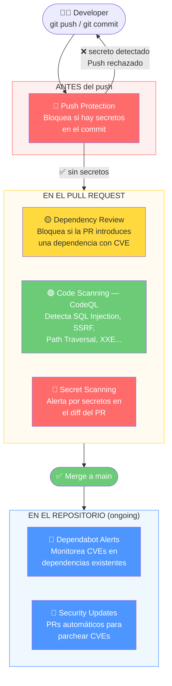
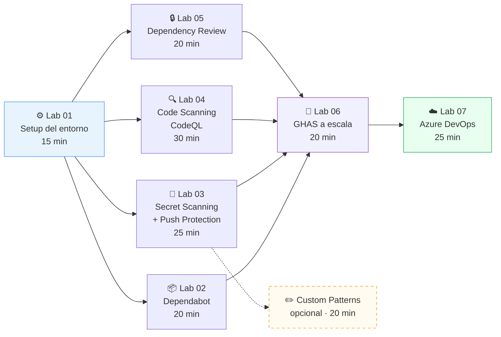

# GitHub Advanced Security — Workshop Práctico

> **⚠️ ADVERTENCIA:** Este repositorio contiene código **intencionalmente vulnerable** con fines educativos. No usar en producción. Ver [SECURITY.md](./SECURITY.md) para más detalles.

---

## ¿De qué va este workshop?

Una brecha de datos promedio cuesta **4.88 millones de dólares** (IBM, 2024). La mayoría empieza con algo pequeño: una API key expuesta en un commit, una dependencia con CVE sin parchear, o un parámetro SQL sin sanitizar.

Este workshop te lleva de cero a hero en **GitHub Advanced Security (GHAS)**: el conjunto de herramientas que convierte tu repositorio en la primera línea de defensa. Aprenderás a detectar, bloquear y remediar vulnerabilidades directamente en el flujo de desarrollo — sin cambiar la forma en que trabaja tu equipo.

Usamos una **API .NET 10 intencionalmente rota** con SQL Injection, Path Traversal, SSRF, XXE, secretos hardcodeados y dependencias con CVEs reales. Todo para que veas GHAS en acción con vulnerabilidades de verdad, no ejemplos de juguete.

---

## Lo que vas a aprender

| Feature | ¿Qué problema resuelve? | Lab |
|---|---|---|
| **Dependabot** | CVEs en dependencias ya en el repo — te dice qué parchear | [Lab 02](./docs/02-dependabot.md) |
| **Secret Scanning** | Secretos y tokens expuestos en commits ya mergeados | [Lab 03](./docs/03-secret-scanning.md) |
| **Push Protection** | Bloquea el push antes de que el secreto entre al historial de Git | [Lab 03](./docs/03-secret-scanning.md) |
| **Code Scanning (CodeQL)** | Vulnerabilidades en el flujo de datos: SQL Injection, SSRF, XXE... | [Lab 04](./docs/04-code-scanning.md) |
| **Dependency Review** | CVEs en dependencias nuevas — bloquea el PR antes de mergear | [Lab 05](./docs/05-dependency-review.md) |
| **GHAS a escala** | Desplegar todas estas herramientas en decenas de repos a la vez | [Lab 06](./docs/06-ghas-at-scale.md) |
| **GHAS en Azure DevOps** | GHAzDO: lo mismo pero en Azure Repos y Azure Pipelines | [Lab 07](./docs/07-ghas-azure-devops.md) |
| **Custom Patterns** | Detectar secretos internos de tu empresa que GitHub no conoce | [Guía](./docs/custom-patterns.md) |

---

## Defensa en profundidad — cómo encajan todas las piezas

GHAS no es una sola herramienta: es una **cadena de controles** que protege el código en cada etapa del ciclo de vida. Este diagrama muestra cuándo actúa cada feature:



---

## Ruta de aprendizaje

Los labs están diseñados para seguirse en orden, pero cada uno es independiente si ya tienes experiencia con GHAS:



---

## Arquitectura del proyecto demo

La aplicación es una **API REST .NET 10** con vulnerabilidades rastreables desde el endpoint hasta el código fuente. Cada vulnerabilidad tiene su CVE o CWE correspondiente y es detectable por una feature específica de GHAS.

```
workshop-github-advanced-security/
├── src/
│   └── UsersApi/                       # .NET 10 Minimal API
│       ├── Program.cs                  # Entry point — endpoints y DI
│       ├── Models/User.cs              # Entidad User
│       ├── Data/AppDbContext.cs        # EF Core InMemory + seed data
│       ├── Services/
│       │   ├── AuthService.cs          # ❌ SQL Injection · Secrets hardcodeados
│       │   ├── ReportService.cs        # ❌ Path Traversal · SSRF · XXE · Insecure Deserialization
│       │   └── CustomPatternDemoService.cs   # ❌ Secretos con formato interno
│       ├── appsettings.json            # ❌ API keys hardcodeadas (Stripe, SendGrid, Azure)
│       └── UsersApi.csproj             # ❌ Paquetes NuGet con CVEs conocidas
├── .github/
│   ├── dependabot.yml                  # Lab 02 — monitoreo de NuGet + GitHub Actions
│   ├── secret_scanning.yml             # Lab 03 — paths excluidos de Secret Scanning
│   └── workflows/
│       ├── codeql.yml                  # Lab 04 — Code Scanning (2 jobs: autobuild + custom)
│       └── dependency-review.yml       # Lab 05 — Dependency Review en PRs
├── docs/
│   ├── 01-setup.md                     # Lab 01: Prerequisitos y configuración
│   ├── 02-dependabot.md                # Lab 02: Dependabot + Dependency Graph
│   ├── 03-secret-scanning.md           # Lab 03: Secret Scanning + Push Protection
│   ├── 04-code-scanning.md             # Lab 04: CodeQL — análisis estático
│   ├── 05-dependency-review.md         # Lab 05: Dependency Review en PRs
│   ├── 06-ghas-at-scale.md             # Lab 06: GHAS a escala (org/enterprise)
│   ├── 07-ghas-azure-devops.md         # Lab 07: GHAS en Azure DevOps (GHAzDO)
│   ├── custom-patterns.md              # Guía: Custom Patterns para secretos internos
│   └── examples/
│       └── release-notes.txt           # Ejemplo para demo de paths-ignore
├── SECURITY.md                         # Política de seguridad del repositorio
└── README.md                           # Este archivo
```

---

## Vulnerabilidades incluidas

### Paquetes NuGet vulnerables

| Paquete | Versión | Severidad | CVE |
|---|---|---|---|
| `Newtonsoft.Json` | 12.0.2 | High | GHSA-5crp-9r3c-p9vr |
| `Microsoft.Data.SqlClient` | 2.0.0 | High | GHSA-98g6-xh36-x2p7 |
| `System.IdentityModel.Tokens.Jwt` | 5.6.0 | Moderate | GHSA-59j7-ghrg-fj52 |
| `log4net` | 2.0.10 | High | GHSA-rxg9-xrhp-64gj |

### Vulnerabilidades en código (CodeQL)

| Tipo | CWE | Archivo | Endpoint |
|---|---|---|---|
| SQL Injection | CWE-89 | `AuthService.cs` | `POST /api/auth/login` |
| SQL Injection | CWE-89 | `AuthService.cs` | `GET /api/auth/search` |
| Path Traversal | CWE-22 | `ReportService.cs` | `GET /api/reports/file` |
| SSRF | CWE-918 | `ReportService.cs` | `GET /api/reports/fetch` |
| XXE | CWE-611 | `ReportService.cs` | `POST /api/reports/parse-xml` |
| Deserialización insegura | CWE-502 | `ReportService.cs` | `POST /api/reports/deserialize` |

### Secretos expuestos (Secret Scanning)

| Tipo de secreto | Ubicación |
|---|---|
| GitHub PAT (`ghp_`) | `AuthService.cs` |
| AWS Access Key (`AKIA`) | `AuthService.cs` |
| Stripe Live Key (`pk_live_`) | `appsettings.json` |
| SendGrid API Key (`SG.`) | `appsettings.json` |
| Azure Storage Connection String | `appsettings.json` |
| JWT hardcoded secret | `AuthService.cs`, `appsettings.json` |

### Secretos de formato interno (Custom Patterns)

| Patrón | Ejemplo | Regex |
|---|---|---|
| API Key corporativa | `MYCO-PRD-1042-a3f9c21b` | `MYCO-[A-Z]{3}-[0-9]{4}-[a-f0-9]{8}` |
| DB Token temporal | `DB-TOKEN-20260101-Xk92mNpQ7rLwVjT4` | `DB-TOKEN-[0-9]{8}-[A-Za-z0-9]{16}` |
| Service account key | `SVC-payments-prod-aB3cD4...` | `SVC-[a-z]+-(?:prod\|staging)-[A-Za-z0-9]{24}` |
| Webhook secret | `whsec_MyCompanyWebhook...` | `whsec_[A-Za-z0-9]{32,64}` |

---

## Prerequisitos

Antes de empezar los labs, asegúrate de tener lo siguiente:

| Requisito | Versión mínima | Notas |
|---|---|---|
| .NET SDK | 10.x | [Descargar](https://dotnet.microsoft.com/download) |
| Git | 2.x | Para clonar y hacer push |
| Cuenta GitHub | — | Con acceso a este repositorio |
| GHAS habilitado | — | En la organización o en el repo (ver Lab 01) |

> **¿Nuevo en GHAS?** No necesitas saber nada previo. El Lab 01 te guía paso a paso por toda la configuración inicial.

---

## Labs del Workshop

> **Tiempo total estimado:** ~2h 45min — ideal para un workshop de día completo o para seguirlo a tu ritmo.

| # | Lab | ¿Qué aprenderás? | ⏱ |
|---|---|---|---|
| 01 | [⚙️ Setup](./docs/01-setup.md) | Habilitar GHAS en el repo, revisar workflows y configurar la base | 15 min |
| 02 | [📦 Dependabot](./docs/02-dependabot.md) | Activar el Dependency Graph, recibir alertas de CVEs y configurar actualizaciones automáticas | 20 min |
| 03 | [🔑 Secret Scanning](./docs/03-secret-scanning.md) | Detectar secretos ya expuestos, configurar Push Protection para bloquearlos antes del commit | 25 min |
| 04 | [🔍 Code Scanning](./docs/04-code-scanning.md) | Ejecutar CodeQL, entender los query suites, revisar y cerrar alertas de SQL Injection, SSRF, XXE... | 30 min |
| 05 | [🔒 Dependency Review](./docs/05-dependency-review.md) | Bloquear PRs que introduzcan dependencias con CVEs antes de llegar a main | 20 min |
| 06 | [🏢 GHAS a escala](./docs/06-ghas-at-scale.md) | Security Configurations, Global Settings y Security Manager para cubrir toda una organización | 20 min |
| 07 | [☁️ GHAS en Azure DevOps](./docs/07-ghas-azure-devops.md) | GHAzDO: Advanced Security en Azure Repos, integración con Azure Pipelines y automatización con la API REST | 25 min |
| — | [✏️ Custom Patterns](./docs/custom-patterns.md) | Crear patrones regex para detectar secretos internos de tu empresa que GitHub no conoce de serie | 20 min |

---

## Inicio rápido

### Clonar el repositorio

```bash
git clone https://github.com/armblaorg/workshop-github-advanced-security.git
cd workshop-github-advanced-security
```

### Ejecutar la API localmente

```bash
cd src/UsersApi
dotnet restore
dotnet run
```

La API estará disponible en:
- **Swagger UI:** `http://localhost:5000/swagger`
- **API base:** `http://localhost:5000/api`

### Endpoints disponibles

```
GET    /api/users              # Listar todos los usuarios
GET    /api/users/{id}         # Obtener usuario por ID
POST   /api/users              # Crear usuario
PUT    /api/users/{id}         # Actualizar usuario
DELETE /api/users/{id}         # Eliminar usuario

POST   /api/auth/login         # Login (SQL Injection demo)
GET    /api/auth/search        # Buscar por nombre (SQL Injection demo)

GET    /api/reports/file       # Leer archivo (Path Traversal demo)
GET    /api/reports/fetch      # Fetch URL externa (SSRF demo)
POST   /api/reports/parse-xml  # Parsear XML (XXE demo)
POST   /api/reports/deserialize# Deserializar JSON (Insecure Deserialization demo)
```

---

## Estado de GHAS en el repositorio

| Feature | Estado | Configuración |
|---|---|---|
| Dependabot alerts | Activo | `.github/dependabot.yml` |
| Dependabot security updates | Activo | Automático |
| Secret Scanning | Activo | Habilitado en Settings |
| Push Protection | Activo | Habilitado en Settings |
| Code Scanning | Activo | `.github/workflows/codeql.yml` |
| Dependency Review | Activo | `.github/workflows/dependency-review.yml` |
| Custom Patterns | Manual | Ver `docs/custom-patterns.md` |

---

## Recursos

- [GitHub Advanced Security Docs](https://docs.github.com/en/code-security)
- [CodeQL Query Suite Reference](https://docs.github.com/en/code-security/code-scanning/managing-your-code-scanning-configuration/codeql-query-suites)
- [Dependabot Configuration Reference](https://docs.github.com/en/code-security/dependabot/dependabot-version-updates/configuration-options-for-the-dependabot.yml-file)
- [Secret Scanning Pattern Reference](https://docs.github.com/en/code-security/secret-scanning/introduction/supported-secret-scanning-patterns)
- [Dependency Review Action](https://github.com/actions/dependency-review-action)
- [Hyperscan Regex Syntax](https://intel.github.io/hyperscan/dev-reference/compilation.html#pattern-support)

---

## Licencia

MIT — ver [LICENSE](./LICENSE) para detalles.

Este proyecto es solo para fines educativos. No usar en producción.
