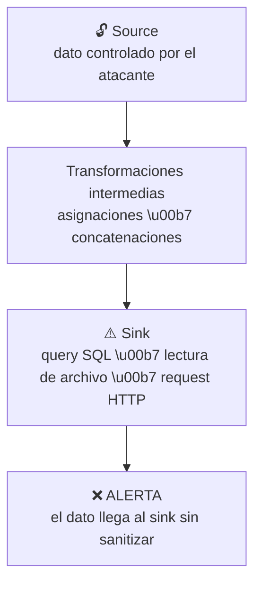

# Lab 04 — Code Scanning: Análisis Estático con CodeQL

Dependabot cuida las dependencias. Secret Scanning cuida los secretos. Pero, ¿quién vigila el código que tú mismo escribes?

**CodeQL** es el motor de análisis estático de GitHub. No busca patrones de texto ni firma de malware: modela el programa como una base de datos y ejecuta queries sobre el **flujo real de los datos**: desde el input del usuario hasta la query SQL, la ruta de archivo o la petición HTTP. Si el dato no pasa por una sanitización adecuada, CodeQL creará una alerta.

En este lab ejecutarás CodeQL sobre la API demo y verás cómo detecta SQL Injection, SSRF, Path Traversal, XXE y deserialización insegura, las mismas vulnerabilidades que cualquier equipo puede introducir sin darse cuenta.

## ¿Qué vas a aprender en este lab?

- Cómo CodeQL analiza el flujo de datos para detectar vulnerabilidades
- Identificar las vulnerabilidades del proyecto y sus patrones de código
- Comparar las dos estrategias de build: `autobuild` vs custom build steps
- Revisar las alertas generadas y aplicar las correcciones

---

## Contexto: ¿Cómo funciona CodeQL?

CodeQL no busca patrones de texto: analiza el **flujo de datos** a través del código:



Este enfoque se llama **taint analysis** y es superior a los linters tradicionales porque detecta vulnerabilidades aunque el código esté distribuido en múltiples métodos y archivos.

---

## Paso 1 — El workflow de CodeQL

### Nombre del archivo: `codeql.yml`

Cuando habilitas Code Scanning con **Advanced Setup** desde la UI de GitHub
(Settings → Advanced Security → Code Security → CodeQL analysis → Set up → Advanced), GitHub genera automáticamente
un archivo llamado `codeql.yml` en `.github/workflows/`.

Este nombre es el estándar del Advanced Setup: a diferencia del Default Setup
(que no genera archivo de workflow visible), el Advanced Setup te entrega el YAML
completo para que lo personalices.

Abre `.github/workflows/codeql.yml`. El archivo define dos jobs:

> **📌 Concepto clave:** Para lenguajes compilados (C#, Java, C/C++, Go, Swift), CodeQL realiza la extracción **monitoreando el proceso de build**. Observa los comandos de compilación (`make`, `javac`, `dotnet build`) y extrae los datos relevantes de cada paso ejecutado. Con esta información construye una **base de datos semántica** del código.
>
> Este enfoque garantiza que CodeQL capture una representación precisa y real del código tal como se compila, incluyendo configuraciones específicas de plataforma o lógica condicional usada durante el build.

### Job 1: `analyze-autobuild`

```yaml
- name: Autobuild
  uses: github/codeql-action/autobuild@v3
```

CodeQL detecta automáticamente el sistema de build del proyecto y lo ejecuta.
Para .NET, identifica el `.csproj` o `.sln` y ejecuta `dotnet build`.

**Ventaja:** sin configuración extra.
**Limitación:** falla en proyectos con estructura no estándar.

### Job 2: `analyze-custom-build`

```yaml
- name: Restore NuGet packages
  run: dotnet restore src/UsersApi/UsersApi.csproj

- name: Build
  run: |
    dotnet build src/UsersApi/UsersApi.csproj \
      --configuration Release \
      --no-restore \
      /p:UseSharedCompilation=false
```

Comandos de compilación explícitos.
`/p:UseSharedCompilation=false` es crítico: desactiva el servidor de compilación compartido de Roslyn para que CodeQL pueda interceptar todos los procesos del compilador.

**Ventaja:** control total (versión del SDK, flags, proyectos específicos).
**Uso:** monorepos, proyectos con generación de código, CI/CD complejos.

---

## Paso 2 — Suite de queries

En ambos jobs se usa:

```yaml
queries: security-extended
```

| Suite | Descripción | Falsos positivos |
|---|---|---|
| `default` | Queries de alta precisión y bajo ruido | Bajo |
| `security-extended` | Más queries de seguridad, mayor cobertura | Medio |
| `security-and-quality` | Seguridad + problemas de calidad de código | Alto |

Para este workshop se usa `security-extended` para maximizar las alertas detectadas.

> **📌 Concepto clave:** `security-extended` incluye **todas las queries del suite `default` más queries adicionales que detectan issues de menor severidad**. Estas queries adicionales tienen ligeramente menor precisión, por lo que pueden generar más falsos positivos que `default`.
>
> En el examen, las otras opciones de respuesta suelen ser **rutas a language packs** (ej. `codeql/csharp-queries`): los language packs contienen las queries individuales, pero no son query suites en sí mismos. Solo `security-extended` (y `default`) son query suites built-in con nombre corto reconocido por GHAS.
>
> **Comparación directa:**
> | Suite | Queries incluidas | Precisión | Cuándo usarlo |
> |---|---|---|---|
> | `default` | Solo queries de alta confianza | Alta, pocos FP | Proyectos en producción con bajo ruido |
> | `security-extended` | `default` + queries de menor severidad | Media, más FP | Más visibilidad, code hygiene, workshops |
>
> Fuente: [CodeQL query suites — GitHub Docs](https://docs.github.com/en/code-security/concepts/code-scanning/codeql/codeql-query-suites)

**Ejemplo en el workflow — cambiar entre suites:**

```yaml
# Opción A: suite default (alta precisión, menos alertas)
- uses: github/codeql-action/init@v3
  with:
    languages: csharp
    queries: default

# Opción B: security-extended (más cobertura, incluye lower-severity)
- uses: github/codeql-action/init@v3
  with:
    languages: csharp
    queries: security-extended

# Opción C: language pack (NO es una query suite — es una colección de queries)
# Esto NO es equivalente a usar una suite built-in
- uses: github/codeql-action/init@v3
  with:
    languages: csharp
    packs: codeql/csharp-queries  # pack, no suite
```

> ⚠️ `codeql/csharp-queries` es un **language pack**: contiene queries individuales pero no es una query suite. En preguntas del examen, esta opción es un distractor incorrecto cuando la pregunta pide la suite que detecta issues de menor severidad.

### Extensiones de archivo en CodeQL

> **📌 Concepto clave:** Las definiciones de query suites se almacenan en archivos YAML con extensión **`.qls`**. Al referenciar `security-extended` en el workflow, se usa el nombre corto del archivo `.qls` interno de GitHub, no es necesario escribir la ruta completa.
>
> | Extensión | Tipo | Descripción |
> |---|---|---|
> | `.qls` | **Query suite** | Define una colección de queries (YAML). Los nombres cortos `default`, `security-extended` son aliases de archivos `.qls` internos |
> | `.ql` | **Query individual** | Una sola consulta CodeQL: detecta un tipo de vulnerabilidad específico |
> | `.qll` | **Librería** | Código reutilizable importado por archivos `.ql` |
> | `.yml` | **Workflow** | Configura GitHub Actions, sin relación con query suites |

### Opciones para agregar queries adicionales

> **📌 Concepto clave:** Al configurar Code Scanning con CodeQL, hay **dos formas** de especificar queries adicionales en el workflow:
>
> | Opción | Parámetro | Descripción |
> |---|---|---|
> | **Packs** | `packs:` | Instala uno o más CodeQL query packs y ejecuta su suite por defecto. Formato: `scope/pack-name@version` |
> | **Queries** | `queries:` | Apunta a un archivo `.ql`, un directorio con múltiples `.ql`, un archivo `.qls`, o cualquier combinación |
>
> `github/codeql` es un nombre de repositorio, **no** es un parámetro de configuración válido. `scope` es la cuenta/org que publicó un pack, tampoco es un parámetro.
>
> Se pueden usar `packs` y `queries` **juntos** en el mismo workflow.

```yaml
# Ejemplo combinando packs + queries en el mismo job
- uses: github/codeql-action/init@v3
  with:
    languages: csharp
    # queries: apunta a una suite o archivo .ql
    queries: security-extended
    # packs: instala packs adicionales de una org/cuenta
    packs: my-company/my-csharp-queries@1.0.0
```

**Ejemplo de custom query suite** (`.qls`) para ejecutar solo las queries de SQL Injection y Path Traversal del pack de C#:

```yaml
# my-custom-suite.qls
- queries: .
  from: codeql/csharp-queries
- include:
    tags contain:
      - security
      - correctness
- exclude:
    tags contain: experimental
- exclude:
    id:
      - cs/web/unvalidated-url-redirection  # excluir query específica
```

Para usarlo en el workflow:

```yaml
- name: Perform CodeQL Analysis
  uses: github/codeql-action/analyze@v3
  with:
    queries: ./.github/codeql/my-custom-suite.qls  # ruta al .qls propio
```

---

## Paso 3 — Vulnerabilidades del proyecto

### SQL Injection — `AuthService.cs`

```csharp
// ❌ VULNERABLE: el input del usuario se concatena directamente en la query
public async Task<bool> ValidateUserAsync(string username, string password)
{
    var query = "SELECT COUNT(*) FROM Users WHERE Name = '" + username
              + "' AND Password = '" + password + "'";
    // ...
}

// ❌ VULNERABLE: variante con string interpolation (también detectada)
public async Task<object?> FindUserByNameAsync(string name)
{
    var query = $"SELECT * FROM Users WHERE Name = '{name}'";
    // ...
}
```

**Exploit de ejemplo:**
```
username: ' OR '1'='1' --
password: anything
```
La query resultante devuelve todos los usuarios, bypasseando la autenticación.

**Fix:**
```csharp
// ✅ CORRECTO: parámetros SQL
var query = "SELECT COUNT(*) FROM Users WHERE Name = @Name AND Password = @Pass";
command.Parameters.AddWithValue("@Name", username);
command.Parameters.AddWithValue("@Pass", password);
```

---

### Path Traversal — `ReportService.cs`

```csharp
// ❌ VULNERABLE: el input del usuario controla la ruta del archivo
public string GetReportContent(string fileName)
{
    var filePath = Path.Combine(_reportsBasePath, fileName);
    return File.ReadAllText(filePath);
}
```

**Exploit de ejemplo:**
```
GET /api/reports/file?fileName=../../etc/passwd
```
`Path.Combine("reports", "../../etc/passwd")` resulta en `/etc/passwd`.

**Fix:**
```csharp
// ✅ CORRECTO: validar que la ruta está dentro del directorio permitido
public string GetReportContent(string fileName)
{
    var fullPath = Path.GetFullPath(Path.Combine(_reportsBasePath, fileName));
    if (!fullPath.StartsWith(_reportsBasePath))
        throw new UnauthorizedAccessException("Acceso denegado");
    return File.ReadAllText(fullPath);
}
```

---

### SSRF — Server-Side Request Forgery — `ReportService.cs`

```csharp
// ❌ VULNERABLE: la URL viene del usuario sin validación
public async Task<string> FetchExternalReportAsync(string url)
{
    var client = _httpClientFactory.CreateClient();
    var response = await client.GetAsync(url);
    return await response.Content.ReadAsStringAsync();
}
```

**Exploit de ejemplo:**
```
GET /api/reports/fetch?url=http://169.254.169.254/metadata/instance
```
Permite acceder al endpoint de metadata de instancias en Azure/AWS/GCP, obteniendo credenciales temporales de la identidad asignada.

**Fix:**
```csharp
// ✅ CORRECTO: allowlist de dominios permitidos
public async Task<string> FetchExternalReportAsync(string url)
{
    var allowedHosts = new[] { "reports.empresa.com", "api.proveedor.com" };
    var uri = new Uri(url);
    if (!allowedHosts.Contains(uri.Host))
        throw new ArgumentException("URL no permitida");

    var client = _httpClientFactory.CreateClient();
    var response = await client.GetAsync(uri);
    return await response.Content.ReadAsStringAsync();
}
```

---

### XXE — XML External Entity — `ReportService.cs`

```csharp
// ❌ VULNERABLE: XmlDocument resuelve entidades externas por defecto
public string ParseUserXmlData(string xmlInput)
{
    var xmlDoc = new XmlDocument();
    xmlDoc.LoadXml(xmlInput);
    return xmlDoc.SelectSingleNode("//Name")?.InnerText ?? "Unknown";
}
```

**Exploit de ejemplo:**
```xml
<?xml version="1.0"?>
<!DOCTYPE foo [
  <!ENTITY xxe SYSTEM "file:///etc/passwd">
]>
<User><Name>&xxe;</Name></User>
```
El servidor lee `/etc/passwd` y lo devuelve en la respuesta.

**Fix:**
```csharp
// ✅ CORRECTO: deshabilitar DTD y entidades externas
public string ParseUserXmlData(string xmlInput)
{
    var settings = new XmlReaderSettings
    {
        DtdProcessing = DtdProcessing.Prohibit,
        XmlResolver = null
    };
    using var reader = XmlReader.Create(new StringReader(xmlInput), settings);
    var xmlDoc = new XmlDocument { XmlResolver = null };
    xmlDoc.Load(reader);
    return xmlDoc.SelectSingleNode("//Name")?.InnerText ?? "Unknown";
}
```

---

### Deserialización insegura — `ReportService.cs`

```csharp
// ❌ VULNERABLE: TypeNameHandling.All permite instanciar tipos arbitrarios
public object? DeserializeUserData(string json)
{
    var settings = new JsonSerializerSettings
    {
        TypeNameHandling = TypeNameHandling.All  // ❌
    };
    return JsonConvert.DeserializeObject(json, settings);
}
```

**Por qué es peligroso:**
`TypeNameHandling.All` incluye metadatos de tipo en el JSON serializado y los lee al deserializar. Un atacante puede enviar un JSON que instancie tipos del sistema (como `System.IO.File`) para ejecutar código arbitrario.

**Fix:**
```csharp
// ✅ CORRECTO: nunca usar TypeNameHandling.All con datos externos
public UserData? DeserializeUserData(string json)
{
    return JsonConvert.DeserializeObject<UserData>(json); // tipo explícito y seguro
}
```

---

## Paso 4 — Ver las alertas en GitHub

1. Ve al repositorio → **Security** → **Code scanning**
2. Verás las alertas agrupadas por tipo de vulnerabilidad
3. Cada alerta muestra:
   - Archivo y línea exacta
   - Descripción del problema
   - El **data flow path**: cómo el dato viaja desde el source hasta el sink
   - Sugerencia de fix
   - CWE asociado

### Filtrar alertas

```
Tool: CodeQL
Severity: High, Critical
Rule: sql-injection, path-injection, ssrf
```

---

## Paso 4b — SARIF: el formato estándar de resultados

### ¿Qué es SARIF?

**SARIF** (Static Analysis Results Interchange Format) es un estándar JSON abierto (OASIS) diseñado para representar los resultados de herramientas de análisis estático de código. GitHub lo adoptó como el formato universal para Code Scanning; cualquier herramienta que genere un archivo `.sarif` puede publicar sus alertas en Security → Code scanning.

```
Herramienta de análisis          GitHub Code Scanning
(CodeQL, Semgrep, Snyk...)  →   Security → Code scanning alerts
        genera .sarif                  muestra alertas
```

### CodeQL vs herramientas SARIF de terceros

> **📌 Concepto clave:** Cuando usas una herramienta **SARIF-compatible de tercero** (no CodeQL) en GitHub Actions, **debes agregar manualmente un paso final** que suba el archivo `.sarif` a GitHub con `github/codeql-action/upload-sarif`. Sin ese paso, el archivo se genera en el runner pero GitHub nunca recibe los resultados.
>
> En contraste, `github/codeql-action/analyze` (usado por CodeQL) **sube automáticamente**: el upload está integrado en la acción.

| Escenario | Upload automático | Paso manual requerido |
|---|---|---|
| `github/codeql-action/analyze` (CodeQL nativo) | ✅ Sí (integrado en la acción) | No |
| Herramienta SARIF de tercero (Semgrep, Snyk, etc.) | ❌ No | ✅ Sí (`upload-sarif`) |

### Ejemplo: herramienta SARIF de tercero

```yaml
jobs:
  semgrep-scan:
    runs-on: ubuntu-latest
    permissions:
      security-events: write   # requerido para subir resultados

    steps:
      - uses: actions/checkout@v4

      - name: Run Semgrep          # la herramienta genera el archivo .sarif
        run: |
          pip install semgrep
          semgrep --sarif --output results.sarif .

      - name: Upload SARIF to GitHub   # ← PASO OBLIGATORIO para terceros
        uses: github/codeql-action/upload-sarif@v3
        with:
          sarif_file: results.sarif
        # Sin este paso, las alertas NO aparecen en Security → Code scanning
```

### Estructura básica de un archivo SARIF

```json
{
  "version": "2.1.0",
  "runs": [
    {
      "tool": {
        "driver": {
          "name": "Semgrep",
          "rules": [...]
        }
      },
      "results": [
        {
          "ruleId": "csharp.sql-injection",
          "message": { "text": "SQL Injection detected" },
          "locations": [
            {
              "physicalLocation": {
                "artifactLocation": { "uri": "src/UsersApi/Services/AuthService.cs" },
                "region": { "startLine": 42 }
              }
            }
          ],
          "level": "error"
        }
      ]
    }
  ]
}
```

### Permiso requerido

Para subir resultados SARIF, el workflow necesita el permiso `security-events: write`, tanto para CodeQL como para herramientas de terceros:

```yaml
permissions:
  security-events: write
  contents: read
```

---

## Paso 5 — Importancia del workflow file en la rama

Para que Code Scanning se ejecute en una rama, el archivo `codeql.yml` **debe existir en esa rama**. Si la rama no lo contiene, GitHub Actions no ejecutará el análisis aunque Code Scanning esté habilitado en el repositorio.

**Demostración:**

```bash
# Crea un branch SIN el workflow
git checkout -b demo/sin-codeql
git rm .github/workflows/codeql.yml
git commit -m "demo: branch without CodeQL workflow"
git push origin demo/sin-codeql
```

Abre un PR de `demo/sin-codeql` → `main`.
Observa que el check de CodeQL **no aparece** en el PR porque la rama origen no tiene el workflow.

---

## Resumen de vulnerabilidades detectadas

| Vulnerabilidad | Archivo | CWE | Endpoint afectado |
|---|---|---|---|
| SQL Injection (concatenación) | `AuthService.cs` | CWE-89 | `POST /api/auth/login` |
| SQL Injection (interpolación) | `AuthService.cs` | CWE-89 | `GET /api/auth/search` |
| Path Traversal | `ReportService.cs` | CWE-22 | `GET /api/reports/file` |
| SSRF | `ReportService.cs` | CWE-918 | `GET /api/reports/fetch` |
| XXE Injection | `ReportService.cs` | CWE-611 | `POST /api/reports/parse-xml` |
| Deserialización insegura | `ReportService.cs` | CWE-502 | `POST /api/reports/deserialize` |
| Clave JWT hardcodeada | `AuthService.cs` | CWE-321 | `POST /api/auth/login` |

---

## Siguiente paso

¡Excelente! Has visto CodeQL detectar vulnerabilidades reales en el código. El siguiente lab cierra el círculo: Dependency Review, que bloquea los CVEs antes de que entren al repositorio vía Pull Request.

➡️ **Siguiente:** [Lab 05 — Dependency Review: bloqueo de CVEs en Pull Requests](./05-dependency-review.md)

🏢 ¿Quieres configurar GHAS en toda la organización? ➡️ [Lab 06 — GHAS a escala](./06-ghas-at-scale.md)
