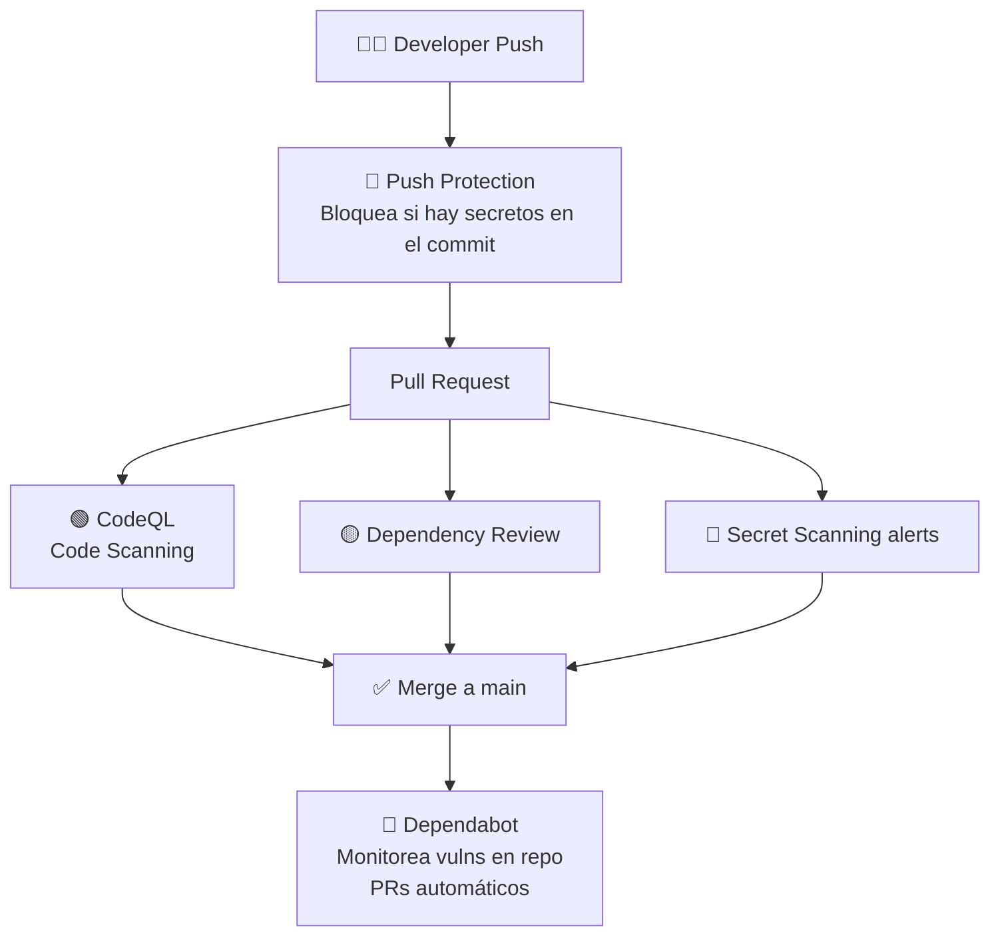

# Lab 05 — Dependency Review: Bloqueo de CVEs en Pull Requests

Dependabot es reactivo: te avisa cuando ya tienes una dependencia vulnerable en el repositorio. Pero ¿y si puedes parar el problema **antes** de que llegue a `main`?

Eso es exactamente lo que hace **Dependency Review**: evalúa las dependencias que introduce un Pull Request y **bloquea el merge** si alguna tiene un CVE conocido o una licencia incompatible. En este lab vas a activarlo, verlo en acción y explorar sus opciones de configuración.

## ¿Qué vas a aprender en este lab?

- Entender la diferencia entre Dependabot y Dependency Review
- Configurar el workflow para detectar nuevas dependencias vulnerables
- Demostrar el bloqueo de un PR que introduce un paquete con CVE
- Revisar las opciones de configuración disponibles

---

## Dependabot vs Dependency Review

Estas dos herramientas trabajan en momentos distintos del ciclo de vida:

| Característica | Dependabot | Dependency Review |
|---|---|---|
| **¿Cuándo actúa?** | Detecta vulns en dependencias YA en el repo | Evalúa dependencias NUEVAS antes de mergear |
| **Tipo de alerta** | Alerta en Security tab + PR automático | Check de status en el PR — bloquea el merge |
| **Acción** | Abre PR para actualizar la versión | Falla o aprueba el check del PR |
| **Formato de salida** | Security advisory + PR | Comentario en el PR + status check |
| **Requiere** | Habilitado en repo settings | Workflow `.github/workflows/dependency-review.yml` |

**En resumen:** Dependabot arregla lo que ya tienes. Dependency Review previene que entren nuevos problemas.

> **📌 Concepto clave (GH-500):** Para **detectar y bloquear dependencias vulnerables antes del merge**, los desarrolladores deben usar la **Dependency Review GitHub Action** en sus workflows de pull request. La action escanea todos los cambios de dependencias propuestos y marca los paquetes con vulnerabilidades conocidas.
>
> Es una **medida preventiva durante el desarrollo**, a diferencia de Dependabot, que **reacciona después del hecho** (cuando la dependencia vulnerable ya está en el repositorio).
>
> | Herramienta | Momento | Mecanismo |
> |---|---|---|
> | **Dependency Review Action** | **Antes** del merge (en el PR) | Bloquea el PR con un check fallido |
> | **Dependabot** | **Después** (dependencia ya en el repo) | Abre un PR para actualizar la versión |
>
> Fuente: [About dependency review — GitHub Docs](https://docs.github.com/en/code-security/concepts/supply-chain-security/about-dependency-review#about-the-dependency-review-action)

**Ejemplo — workflow mínimo para bloquear PRs con dependencias vulnerables:**

```yaml
# .github/workflows/dependency-review.yml
name: Dependency Review

on:
  pull_request:   # OBLIGATORIO: solo funciona en pull_request, no en push
    branches: [ "main" ]

permissions:
  contents: read

jobs:
  dependency-review:
    runs-on: ubuntu-latest
    steps:
      - uses: actions/checkout@v4
      - uses: actions/dependency-review-action@v4
        with:
          fail-on-severity: moderate   # falla ante CVEs de severidad Media, Alta o Crítica
```

> ⚠️ El trigger debe ser `pull_request`. Con `push` o `workflow_dispatch` la action no puede comparar el diff de dependencias y falla.

---

## El workflow de Dependency Review

Abre `.github/workflows/dependency-review.yml`:

```yaml
on:
  pull_request:
    branches: [ "main" ]
  workflow_dispatch:
```

### ¿Por qué `pull_request` y no `push`?

Dependency Review necesita **comparar dos estados**: las dependencias en `main` (base) vs las dependencias en el PR (head). Solo el evento `pull_request` proporciona ambos manifiestos para el diff.

Con `push` o `schedule`, la acción no tiene un "antes" para comparar y falla con error.

### ¿Por qué también `workflow_dispatch`?

Permite ejecutar manualmente el análisis desde la UI de GitHub → **Actions** → **Dependency Review** → **Run workflow**.

Útil para demostraciones sin abrir un PR real, o para re-ejecutar el análisis después de actualizar la configuración.

### `paths-ignore` — Excluir archivos que no afectan dependencias

> **📝 Nota:** `paths-ignore` en el trigger `pull_request` del workflow YAML controla qué cambios de archivos **activan** el workflow, no qué archivos se analizan.

Con `paths-ignore`, el workflow **no se ejecuta** si el PR solo modifica archivos que coincidan con los patrones especificados. Esto evita runs innecesarios cuando nadie tocó las dependencias del proyecto.

```yaml
on:
  pull_request:
    branches:
      - main
      - develop
    paths-ignore:
      # Cambios solo en archivos .txt o .md no requieren dependency review
      # ya que no modifican dependencias del proyecto
      - '**/*.md'
      - '**/*.txt'
```

**Comportamiento:**
- PR modifica únicamente `docs/release-notes.txt` → workflow **no se ejecuta** ✅
- PR modifica `src/UsersApi/UsersApi.csproj` → workflow **sí se ejecuta** ✅
- PR modifica `README.md` + `UsersApi.csproj` → workflow **sí se ejecuta** (basta con un archivo fuera de paths-ignore)

**`paths-ignore` vs `paths`:**

| Filtro | Comportamiento |
|---|---|
| `paths-ignore: ['**/*.md']` | Ejecuta el workflow para **todos los archivos excepto** los `.md` |
| `paths: ['**/*.csproj', '**/package.json']` | Ejecuta el workflow **solo si** se modifica un `.csproj` o `package.json` |

**Archivo de ejemplo en el repo:** `docs/examples/release-notes.txt` — simula notas de versión que no deben disparar Dependency Review.

> ⚠️ **Importante:** `paths-ignore` en el workflow YAML es diferente de `paths-ignore` en `.github/secret_scanning.yml`.
> - Workflow YAML `paths-ignore` → controla **cuándo se ejecuta** el workflow
> - `.github/secret_scanning.yml` `paths-ignore` → controla **qué archivos se escanean** en busca de secretos

---

## Paso 1 — Revisar la configuración actual

```yaml
- name: Dependency Review
  uses: actions/dependency-review-action@v4
  with:
    fail-on-severity: moderate
    deny-licenses: 'GPL-2.0, GPL-3.0, AGPL-3.0'
    comment-summary-in-pr: always
```

| Parámetro | Valor | Efecto |
|---|---|---|
| `fail-on-severity` | `moderate` | Falla ante CVEs de severidad Media, Alta o Crítica |
| `deny-licenses` | GPL-2.0, GPL-3.0, AGPL-3.0 | Bloquea paquetes con licencias copyleft incompatibles |
| `comment-summary-in-pr` | `always` | Siempre publica un comentario con el resumen en el PR |

---

## Paso 2 — Demostración: Introducir un paquete vulnerable

### Crear el branch

```bash
cd workshop-github-advanced-security
git checkout -b demo/vulnerable-package
```

### Agregar el paquete vulnerable

```bash
cd src/UsersApi
dotnet add package System.Net.Http --version 4.3.0
```

Esta versión de `System.Net.Http` tiene una vulnerabilidad conocida de alta severidad (GHSA-7jgj-8wvc-jh57: Remote Code Execution vía redirección).

### Verificar que se agregó al `.csproj`

```xml
<PackageReference Include="System.Net.Http" Version="4.3.0" />
```

### Commit y push

```bash
git add src/UsersApi/UsersApi.csproj
git commit -m "test: add System.Net.Http 4.3.0 for dependency review demo"
git push origin demo/vulnerable-package
```

### Abrir el Pull Request

1. Ve al repositorio → **Pull requests** → **New pull request**
2. Base: `main` | Compare: `demo/vulnerable-package`
3. Crea el PR

### Observar el resultado

El check **Dependency Review** fallará con:

```
❌ Dependency Review
1 vulnerability found.

System.Net.Http 4.3.0 — High severity
GHSA-7jgj-8wvc-jh57 — Improper Restriction of Operations within the Bounds of a Memory Buffer
Fixed in: 4.3.4
```

El comentario automático en el PR listará:
- Paquetes agregados con vulnerabilidades
- Severidad y CVE/GHSA
- Versión con el fix disponible
- Paquetes con licencias bloqueadas (si aplica)

---

## Paso 3 — Opciones avanzadas de configuración

### Permitir CVEs específicos

Si el equipo ya tiene un plan de remediación documentado y necesita mergear de forma temporal:

```yaml
- uses: actions/dependency-review-action@v4
  with:
    fail-on-severity: moderate
    allow-ghsas: GHSA-7jgj-8wvc-jh57  # CVE temporal aprobado por el equipo
```

**Advertencia:** documentar siempre la razón y crear un ticket de seguimiento.

### Bloquear solo paquetes nuevos

Por defecto, la acción evalúa todos los cambios en el diff. Para restringir solo a nuevas dependencias (no a actualizaciones de versión):

```yaml
- uses: actions/dependency-review-action@v4
  with:
    fail-on-severity: high
    comment-summary-in-pr: on-failure  # solo comenta si falla
```

### Integración con revisión manual

```yaml
- uses: actions/dependency-review-action@v4
  with:
    fail-on-severity: moderate
    deny-licenses: 'GPL-2.0, GPL-3.0, AGPL-3.0'
    comment-summary-in-pr: always
    warn-only: false  # false = falla el check; true = solo warning
```

---

## Paso 4 — Limpieza

Después de la demo, eliminar el PR y el branch:

```bash
# Cierra el PR desde la UI de GitHub, luego:
git checkout main
git branch -d demo/vulnerable-package
git push origin --delete demo/vulnerable-package
```

---

## Resumen

| Acción | Resultado esperado |
|---|---|
| Abrir PR con paquete con CVE alto | ❌ Check falla, merge bloqueado |
| Abrir PR con paquete con licencia GPL | ❌ Check falla por licencia denegada |
| Abrir PR con paquete limpio | ✅ Check pasa |
| Actualizar a versión sin CVE | ✅ Check pasa |
| `workflow_dispatch` sin PR | ✅ Ejecuta análisis del estado actual de main |

---

## Flujo completo de protección GHAS



---

## Siguiente paso

¡Bien hecho! Ya tienes el bloqueo preventivo funcionando en Pull Requests. Ahora viene el lab donde aprenderás a desplegar todo esto (Dependabot, Secret Scanning, Code Scanning y Dependency Review) en decenas de repositorios a la vez.

➡️ **Siguiente:** [Lab 06 — GHAS a escala: Security Configurations y Global Settings](./06-ghas-at-scale.md)
