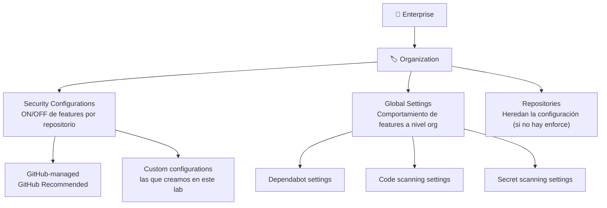

# Lab 06 — GHAS a Escala: Configuración desde la Organización y Enterprise

Ya tienes GHAS funcionando en un repositorio. Ahora viene la pregunta real: ¿cómo se hace esto en una organización con 50, 100 o 1000 repositorios?

Configurar repo por repo no escala. GitHub lo sabe y ofrece dos mecanismos complementarios para gestionar la seguridad a nivel de organización: **Security Configurations** (qué features están habilitadas en cada repo) y **Global Settings** (cómo se comportan esas features). En este lab los configurarás desde cero y entenderás cómo se aplican desde la org hasta cada repositorio.

## ¿Qué vas a aprender en este lab?

- La diferencia entre **Security Configurations** y **Global Settings**
- Cómo crear y aplicar una Security Configuration personalizada a múltiples repositorios
- Cómo configurar Global Settings para Dependabot, Code Scanning y Secret Scanning
- El rol de Security Manager y cómo delegar la gestión de seguridad sin dar permisos de admin

---

## El problema de la escala

Configurar GHAS repositorio por repositorio no es sostenible en organizaciones con decenas o cientos de repos. GitHub ofrece dos mecanismos complementarios para gestionar la seguridad a escala:

| Mecanismo | ¿Qué controla? | ¿Dónde se configura? |
|---|---|---|
| **Security Configurations** | Qué features están habilitadas en cada repositorio | Org Settings → Advanced Security → Configurations |
| **Global Settings** | Comportamiento de las features a nivel organización | Org Settings → Advanced Security → Global settings |

**Security Configurations** → controlan si una feature está ON/OFF en un repo.
**Global Settings** → controlan *cómo* se comportan esas features una vez habilitadas.

> **📌 Concepto clave (GH-500):** Security Configurations son colecciones de settings de habilitación que se aplican a repositorios. Global Settings determinan la configuración a nivel organización que heredan todos los repositorios.
>
> Fuente: [About enabling security features at scale — GitHub Docs](https://docs.github.com/en/code-security/securing-your-organization/introduction-to-securing-your-organization-at-scale/about-enabling-security-features-at-scale)

---

## Parte 1 — Security Configurations

### ¿Qué incluye una Security Configuration?

Una Security Configuration agrupa settings de habilitación para:

- **Secret Protection** (Secret Scanning, Push Protection, Validity Checks, Non-provider patterns)
- **Code Security** (Code Scanning default setup, Dependency graph, Dependabot alerts, Security updates)
- **Private vulnerability reporting**

Para cada feature puede configurarse tres estados:
- **Enabled**: se habilita en los repos donde se aplique la configuración
- **Disabled**: se deshabilita
- **Not set**: se deja el estado actual del repo (no se sobreescribe)

### Paso 1 — Crear una Security Configuration personalizada

**Navegar a la configuración:**
```
GitHub UI → Tu avatar (esquina superior derecha) → Organizations
→ [Tu organización] → Settings → Security (sidebar)
→ Advanced Security → Configurations → New configuration
```

**Pasos:**

1. Click **New configuration** → selecciona **Custom configuration**
2. Asigna un **nombre** y **descripción** descriptivos (ej. `ghas-workshop-full`, `Configuración completa para repos del workshop`)
3. Configura las secciones según el modelo de licencias de tu organización:

#### Si usas GitHub Advanced Security (licencia clásica):

| Sección | Setting recomendado para workshop |
|---|---|
| GitHub Advanced Security features | **Include** |
| Secret scanning — Alerts | **Enabled** |
| Secret scanning — Push protection | **Enabled** |
| Secret scanning — Validity checks | **Enabled** |
| Secret scanning — Non-provider patterns | **Enabled** |
| Code scanning — Default setup | **Enabled** |
| Dependency graph | **Enabled** |
| Dependabot alerts | **Enabled** |
| Dependabot security updates | **Enabled** |
| Private vulnerability reporting | **Enabled** |

#### Si usas GitHub Secret Protection + GitHub Code Security (modelo nuevo):

El formulario separa las dos secciones; configura cada una individualmente. Las opciones son equivalentes a las anteriores.

4. En la sección **Policy** (opcional):
   - **Use as default for newly created repositories** → `All repositories` para aplicar automáticamente a repos nuevos
   - **Enforce configuration** → `Enforce` para bloquear a los owners de repos de cambiar las features habilitadas/deshabilitadas

> ⚠️ **Importante:** La configuración por defecto solo se aplica automáticamente a **repositorios nuevos**. Los repositorios transferidos a la organización requieren aplicación manual.

5. Click **Save configuration**

### Paso 2 — Aplicar la Security Configuration a repositorios

```
Org Settings → Advanced Security → Configurations
→ Sección "Apply configurations"
```

**Pasos:**

1. Usa los **filtros** para encontrar los repositorios destino (por nombre, visibilidad, lenguaje, etc.)
2. Selecciona los repositorios usando uno de estos métodos:
   - Checkbox individual por repositorio
   - Checkbox "N repositories" para seleccionar la página actual
   - **"Select all"** para seleccionar todos los que coincidan con el filtro activo
3. Click en el dropdown **Apply configuration** → selecciona tu configuración personalizada
4. Revisa el resumen de impacto en licencias y click **Apply**

La configuración se aplica tanto a repositorios activos como archivados (algunas features como Secret Scanning también se ejecutan en repos archivados).

> **📌 Nota GH-500:** Si se aplica una configuración con **Enforce**, los owners de los repositorios **no pueden cambiar** las features que están explícitamente habilitadas o deshabilitadas. Las features en estado "Not set" no se ven afectadas por el enforce.

---

## Parte 2 — Global Settings

Los Global Settings se configuran en:
```
Org Settings → Advanced Security → Global settings
```

Son settings **a nivel de organización**; no controlan si una feature está ON/OFF (eso lo hacen las Security Configurations), sino **cómo se comporta** la feature.

### Global Settings para Dependabot

#### Auto-triage rules

Reglas que instruyen a Dependabot para **cerrar automáticamente** o **snooze** alertas según criterios definidos (severidad, scope, epocas del parche, etc.):

1. En Global settings → **Dependabot** → click **Configure Dependabot rules**
2. Click **New rule** → define los criterios y la acción automática
3. Click **Create rule**

Útil para reducir el ruido de alertas que el equipo ya tiene documentadas o que no son accionables en el corto plazo.

#### Grouped security updates

Agrupa todos los PRs de seguridad de Dependabot en un **único PR** en lugar de uno por paquete:

- Activa: **Grouped security updates** → checkbox

#### Runner type para Dependabot

Por defecto Dependabot usa GitHub-hosted runners. En organization settings puedes configurar **self-hosted runners** con un label personalizado:

```
Global settings → Dependabot → Runner type → Edit runner type
→ Selecciona "Labeled runner" → Introduce el label de tus runners
```

> ⚠️ Los labeled runners no funcionan para repositorios **públicos**: Dependabot siempre usa GitHub-hosted runners en repos públicos por razones de seguridad.

#### Acceso a repositorios privados

Para que Dependabot pueda actualizar dependencias privadas necesita acceso explícito:

```
Global settings → Dependabot → Grant Dependabot access to private repositories
→ Busca y selecciona el repositorio privado
```

---

### Global Settings para Code Scanning

#### Recomendar security-extended query suite

Recomienda el uso del query suite `security-extended` (en lugar del `default`) para todos los repos que usen CodeQL Default Setup:

```
Global settings → Code scanning → Recommend the extended query suite for repositories enabling default setup
→ Activa el checkbox
```

> Esto es una **recomendación**, no un enforce. Los owners de repos pueden seguir usando un query suite diferente si tienen Advanced Setup.

#### Copilot Autofix para CodeQL

Habilita Copilot Autofix para **todos los repositorios** de la organización que usen CodeQL (Default Setup o Advanced Setup). Copilot Autofix sugiere fixes automáticos para alertas de Code Scanning:

```
Global settings → Code scanning → Copilot Autofix → activar
```

#### Expandir CodeQL con model packs

Configura **CodeQL model packs** a nivel de organización para extender el análisis con frameworks adicionales no incluidos en las librerías estándar de CodeQL:

```
Global settings → Code scanning → Expand CodeQL analysis
→ Especifica los model packs publicados via container registry
```

---

### Global Settings para Secret Scanning

#### Resource link para commits bloqueados

Cuando Push Protection bloquea un commit, puedes mostrar un enlace con contexto adicional (ej. página de la política de secretos de tu empresa):

```
Global settings → Secret scanning → Add a resource link in the CLI and the web UI when a commit is blocked
→ Introduce la URL del recurso → Save Link
```

#### Custom patterns a nivel de organización

Define patrones regex personalizados que se aplican a **todos los repositorios de la organización** (en lugar de solo a un repo específico):

```
Global settings → Secret scanning → New pattern
→ Define nombre, regex, mensaje y ejemplos → Save and dry run
```

> Ver [Lab 03](./03-secret-scanning.md) y [Custom Patterns](./custom-patterns.md) para la sintaxis de patrones.

#### Configurar patrones incluidos en Push Protection

Controla qué patrones de secretos activan Push Protection a nivel de organización (en public preview):

```
Global settings → Secret scanning → Additional settings → Pattern configurations → ⚙️
→ Habilita/deshabilita push protection para patrones individuales en la columna "Organization setting"
```

> ⚠️ Los admins de organización y el equipo de seguridad pueden **sobreescribir** la configuración del nivel Enterprise para su organización.

---

## Parte 3 — Security Manager Role

El rol de **Security Manager** permite a miembros de la organización gestionar la seguridad sin ser Organization Owner:

**Capacidades del Security Manager:**
- Ver datos de seguridad de **todos los repositorios** de la organización en Security Overview
- Gestionar Security Configurations y Global Settings
- Acceder a todas las alertas de GHAS (Secret Scanning, Code Scanning, Dependabot)

**Asignar el rol:**
```
Org Settings → Organization roles → Security managers
→ Add a team or member
```

> El rol se asigna a un **equipo**, no a un usuario individual. Todos los miembros del equipo reciben las capacidades del Security Manager.

---

## Parte 4 — Security Overview

**Security Overview** es el panel central para monitorizar el estado de seguridad de toda la organización:

```
GitHub UI → Tu organización → Security (tab en la parte superior)
```

**Lo que puedes ver:**
- Cobertura de GHAS por repositorio (qué features están activas en cada repo)
- Alertas abiertas por tipo (Secret Scanning, Code Scanning, Dependabot)
- Tendencias de alertas a lo largo del tiempo
- Repositorios sin cobertura (donde GHAS no está habilitado)

**Útil para:** identificar gaps de cobertura, priorizar remediación, y demostrar el estado de seguridad a stakeholders.

---

## Resumen: Jerarquía de configuración de GHAS



| Nivel | Herramienta | ¿Qué controla? | ¿Quién puede cambiarla? |
|---|---|---|---|
| Enterprise | Enterprise policies | Qué features pueden habilitarse en la empresa | Enterprise owners |
| Organización | Security Configurations | ON/OFF de features por repo | Org owners, Security managers |
| Organización | Global Settings | Comportamiento de features | Org owners, Security managers |
| Repositorio | Repo settings | ON/OFF de features (si no hay enforce) | Repo admins |

---

## Siguiente paso

¡GHAS funcionando a escala en toda la organización! Si tu equipo trabaja con Azure DevOps además de GitHub, el siguiente lab es para ti.

🔵 **Azure DevOps:** ➡️ [Lab 07 — GHAS en Azure DevOps (GHAzDO)](./07-ghas-azure-devops.md)

🏠 Vuelve al índice: [README.md — Workshop GitHub Advanced Security](../README.md)
