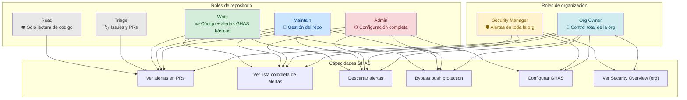

# Guía de Roles y Permisos en GHAS

GitHub Advanced Security no actúa igual para todos los miembros de un equipo. Saber quién puede ver, descartar o configurar cada tipo de alerta es crítico tanto para el diseño de un programa de seguridad como para la respuesta a incidentes. Esta guía consolida —en matrices y explicaciones prácticas— el modelo de permisos completo de GHAS: qué puede hacer cada rol de repositorio, cómo funciona el rol especial de Security Manager a nivel de organización, y cómo están configuradas las notificaciones por defecto para cada servicio.

## ¿Qué vas a aprender en esta guía?

- Los dos ejes del modelo de permisos de GHAS: roles de repositorio y roles de organización
- Matriz completa de permisos por servicio: Dependabot, Secret Scanning, Code Scanning, Push Protection
- Quién recibe notificaciones automáticas y por qué canal
- Cómo funciona el rol Security Manager y cuándo usarlo
- Cómo ampliar el acceso a alertas sin cambiar el rol base de un usuario

---

## Los dos ejes del modelo de permisos

GHAS aplica sus controles de acceso en dos dimensiones independientes que actúan en capas:

```
┌─────────────────────────────────────────────────────┐
│           ROLES DE ORGANIZACIÓN (org-level)          │
│  Organization Owner · Security Manager · Member      │
│  Controlan: configuración global, visibilidad org    │
├─────────────────────────────────────────────────────┤
│           ROLES DE REPOSITORIO (repo-level)          │
│  Read · Triage · Write · Maintain · Admin            │
│  Controlan: acceso a alertas por repo, dismiss, etc. │
└─────────────────────────────────────────────────────┘
```

En la práctica, la mayoría de las decisiones del día a día (ver alertas, descartarlas, configurar GHAS por repo) las determina el **rol de repositorio**. El rol de organización solo añade capacidades cuando hay responsabilidades que cruzan repositorios.

---

## Roles de repositorio — los 5 niveles

GitHub define cinco niveles de acceso en orden creciente de privilegio:

| Nivel | Uso típico |
|---|---|
| **Read** | Lectura de código; issues y PRs en modo lectura |
| **Triage** | Gestión de issues y PRs sin acceso de escritura al código |
| **Write** | Colaborador activo: puede empujar código y gestionar issues |
| **Maintain** | Gestiona el repositorio sin acceso a configuración sensible |
| **Admin** | Control total, incluido el panel de Settings |

> **📌 Concepto clave:** El nivel **Write** es el umbral mínimo para interactuar con la mayoría de las alertas de seguridad. Los roles Read y Triage pueden ver código pero no ven la lista de alertas de GHAS.

---

## Matriz de permisos GHAS por rol de repositorio

Esta tabla consolida todos los permisos de seguridad relevantes en los cinco niveles de acceso.

| Capacidad | Read | Triage | Write | Maintain | Admin |
|---|:---:|:---:|:---:|:---:|:---:|
| **Code Scanning** | | | | | |
| Ver alertas en un PR | ✅ | ✅ | ✅ | ✅ | ✅ |
| Ver la lista completa de alertas | ❌ | ❌ | ✅ | ✅ | ✅ |
| Descartar / cerrar alertas | ❌ | ❌ | ✅ | ✅ | ✅ |
| 📧 Email al detectar alerta en default branch | ❌ | ❌ | ❌ | ❌ | ❌ ² |
| **Secret Scanning** | | | | | |
| Ver alertas en la lista | ❌ | ❌ | ✅ ¹ | ✅ ¹ | ✅ |
| Descartar alertas | ❌ | ❌ | ✅ | ✅ | ✅ |
| 📧 Email al detectar secreto activo | ❌ | ❌ | ❌ | ❌ | ✅ |
| 📧 Email al producirse un bypass de Push Protection | ❌ | ❌ | ❌ | ❌ | ✅ ³ |
| **Dependabot** | | | | | |
| Ver lista de alertas Dependabot | ❌ | ❌ | ✅ | ✅ | ✅ |
| Descartar alertas Dependabot | ❌ | ❌ | ✅ | ✅ | ✅ |
| 📧 Email por CVE Critical / High (nuevo) | ❌ | ❌ | ✅ | ✅ | ✅ |
| 📧 Email por CVE Medium / Low | ❌ | ❌ | ❌ | ❌ | ❌ ⁴ |
| **Push Protection** | | | | | |
| Hacer bypass de push protection (sin delegated bypass) | ❌ | ❌ | ✅ | ✅ | ✅ |
| Aprobar o rechazar solicitudes de bypass (con delegated bypass) | Solo si es designado | Solo si es designado | Solo si es designado | Solo si es designado | ✅ |
| **Configuración** | | | | | |
| Habilitar / deshabilitar GHAS en el repo | ❌ | ❌ | ❌ | ❌ | ✅ |
| Configurar Security Configurations del repo | ❌ | ❌ | ❌ | ❌ | ✅ |
| Crear / editar Security Advisories | ❌ | ❌ | ❌ | ❌ | ✅ |
| Ampliar acceso a alertas a otras personas o equipos | ❌ | ❌ | ❌ | ❌ | ✅ |

> ¹ **Excepción de Secret Scanning para Write y Maintain:** Los usuarios con rol Write o Maintain pueden ver alertas de secret scanning, pero **solo para sus propios commits**. No tienen acceso a la vista de lista completa con todas las alertas del repositorio. El acceso completo a la lista lo tienen los Admin, los Org Owners y los Security Managers.
>
> ² **Code Scanning no envía email por alertas individuales.** Las alertas aparecen como anotaciones en PRs (visibles para todos) y en la pestaña Security (Write+), pero no generan correo automático. Los Admins pueden configurar webhooks o integraciones para recibir notificaciones externas.
>
> ³ **Email de bypass de Push Protection** se envía también a los Org Owners y Security Managers que estén en modo *watching* del repositorio, independientemente de su rol en el repo.
>
> ⁴ **Dependabot solo envía email automático para severidad Critical o High.** Las alertas Medium y Low se muestran en la pestaña Security pero no generan correo por defecto. Cada usuario puede ajustar este umbral en `Settings → Notifications → Dependabot alerts`.

---

## Por servicio — quién ve qué y cuándo

### Dependabot Alerts

Las Dependabot Alerts notifican sobre vulnerabilidades conocidas (CVEs del GitHub Advisory Database) en las dependencias ya presentes en el repositorio.

| Acción | Quién puede |
|---|---|
| Ver la lista de alertas | Write, Maintain, Admin + Org Owner + Security Manager |
| Recibir notificaciones por email (automáticas) | Usuarios con Write, Maintain o Admin en el repo |
| Descartar una alerta con justificación | Write, Maintain, Admin |
| Configurar qué ecosistemas monitorea Dependabot | Admin del repo |
| Habilitar Security Updates (PRs automáticos) | Admin del repo |

**Canal de notificación por defecto:** Email y notificación web para CVEs de severidad **Critical** o **High** dirigidos a todos los usuarios con Write, Maintain o Admin sobre el repositorio. También se generan avisos en la CLI de `git push` si hay dependencias vulnerables.

---

### Secret Scanning

Secret Scanning detecta tokens, claves de API y credenciales previamente empujados al repositorio. Las alertas se generan retroactivamente sobre todo el historial de Git.

| Acción | Quién puede |
|---|---|
| Ver la lista completa de alertas | Admin del repo + Org Owner + Security Manager |
| Ver alertas de sus propios commits | Write, Maintain (solo los suyos) |
| Descartar una alerta (false positive, used in test, etc.) | Write, Maintain, Admin |
| Configurar Validity Checks | Admin del repo |
| Habilitar / deshabilitar Secret Scanning | Admin del repo (o Security Manager) |

> **⚠️ Punto importante:** Los usuarios con rol Write o Maintain **no pueden ver la lista completa de alertas** de secret scanning. Solo ven las alertas generadas por sus propios commits. Si un desarrollador necesita revisar todas las alertas, debe recibir acceso explícito (ver sección "Ampliar acceso") o contar con rol Admin.

---

### Code Scanning (CodeQL)

Code Scanning analiza el código fuente en busca de vulnerabilidades de seguridad y errores de calidad. Los resultados se muestran en la vista de Security del repositorio y como anotaciones en los Pull Requests.

| Acción | Quién puede |
|---|---|
| Ver alertas en un Pull Request (anotaciones) | **Todos** los roles (Read, Triage, Write, Maintain, Admin) |
| Ver la lista completa de alertas en la pestaña Security | Write, Maintain, Admin + Org Owner + Security Manager |
| Descartar una alerta con razón (false positive, won't fix...) | Write, Maintain, Admin |
| Reabrir una alerta descartada | Write, Maintain, Admin |
| Configurar el query suite de CodeQL | Admin del repo |
| Habilitar / deshabilitar Code Scanning | Admin del repo (o Security Manager) |
| Añadir configuraciones SARIF de terceros | Write (puede triggear Actions) |

**Severidades y prioridad:** Code Scanning usa las severidades `critical`, `high`, `medium`, `low` y `note`. Cualquier usuario con acceso a la lista puede filtrar por severidad, pero solo Write+ puede modificar el estado de las alertas.

---

### Push Protection

Push Protection bloquea el commit antes de que entre al historial si detecta un secreto reconocido.

| Acción | Quién puede |
|---|---|
| Hacer bypass (sin delegated bypass configurado) | Write, Maintain, Admin (cualquiera con write access) |
| Configurar Delegated Bypass | Admin del repo (Settings → Advanced Security → Push protection → Delegated bypass) |
| Ser designado como revisor de solicitudes de bypass | Roles específicamente asignados por un Admin |
| Ver alertas de bypass en la pestaña Security | Write, Maintain, Admin + Org Owner + Security Manager |
| Recibir email al producirse un bypass | Org Owner, Security Manager, Admin del repo que están watching el repositorio |
| Habilitar / deshabilitar Push Protection | Admin del repo, Org Owner, Security Manager, Enterprise Owner |

**Bypass con delegated bypass:** Con esta configuración avanzada, los usuarios sin bypass privileges deben enviar una solicitud que un revisor designado aprueba o rechaza. Los revisores pueden ser cualquier rol si el Admin los designa explícitamente.

---

## Roles de organización — capacidades adicionales

Además de los roles de repositorio, GitHub define roles que operan a nivel de organización y afectan a GHAS transversalmente.

### Organization Owner

El org owner tiene acceso completo a todos los repositorios y puede:

- Habilitar GHAS para toda la organización desde `Org Settings → Advanced Security`
- Crear y gestionar Security Configurations y aplicarlas masivamente
- Ver la Security Overview de la organización (alertas agregadas de todos los repos)
- Recibir alertas por email cuando un push protection bypass ocurre en cualquier repo
- Asignar el rol de Security Manager a usuarios o equipos

### Security Manager

El rol Security Manager es un rol de organización que se asigna a un **equipo** (team) o directamente a un miembro, y proporciona capacidades de seguridad sin necesidad de ser org owner.

**Permisos del Security Manager:**

| Capacidad | Detalle |
|---|---|
| Acceso de lectura a todos los repos de la org | Automático al recibir el rol, independientemente del acceso previo |
| Acceso de escritura a todas las alertas de seguridad | Puede ver, descartar y gestionar alertas en cualquier repo |
| Configurar settings de seguridad a nivel org | Security Configurations, Global Settings, GHAS enable/disable |
| Configurar settings de seguridad a nivel repo | Puede habilitar/deshabilitar features en repos individuales |
| Ver la Security Overview de la organización | Vista agregada de todas las alertas en todos los repos |

> **⚠️ Nota:** El Security Manager **no puede acceder al contenido del código** por defecto más allá de los permisos de lectura. Tampoco puede hacer merge de PRs ni gestionar Settings de repositorio (billing, branches, etc.) a menos que tenga permisos adicionales de repositorio.

**Cómo asignar el rol Security Manager:**

```
Org Settings → Member privileges → Security managers → Search team or member → Grant role
```

O con GitHub CLI:

```bash
# Asignar el rol a un equipo
gh api \
  --method PUT \
  -H "Accept: application/vnd.github+json" \
  /orgs/{org}/teams/{team_slug}/security-managers

# Listar todos los Security Managers
gh api /orgs/{org}/security-managers
```

### Organization Member

El rol por defecto de cualquier miembro de la organización. Sin permisos especiales de GHAS: solo ve las alertas de los repositorios a los que tiene acceso Write o superior.

---

## Notificaciones por defecto — quién recibe qué

Esta tabla resume los canales de notificación automáticos por servicio.

| Servicio | Evento | Canal | Destinatarios por defecto |
|---|---|---|---|
| **Dependabot** | Nueva alerta Critical / High | Email + web | Usuarios con Write, Maintain, Admin en el repo |
| **Dependabot** | Nueva alerta Medium / Low | Solo web | Usuarios con Write, Maintain, Admin en el repo |
| **Secret Scanning** | Nuevo secreto activo detectado | Email + web | Admin del repo + Org Owners + Security Managers |
| **Secret Scanning** | Bypass de Push Protection | Email | Org Owners + Security Managers + Admins del repo (watching) |
| **Code Scanning** | Nueva alerta en PR | Anotación en PR | Participantes del PR (cualquier rol que vea el PR) |
| **Code Scanning** | Nueva alerta en default branch | Web (Security tab) | Usuarios con Write, Maintain, Admin |
| **Push Protection** | Bypass realizado | Email | Org Owners + Security Managers + Admins (watching el repo) |

> **💡 Personalizar notificaciones:** Cada usuario puede ajustar sus preferencias de notificación en `Settings → Notifications → Subscriptions`. Las organizaciones pueden gestionar notificaciones a través de Custom Roles y Webhooks para integraciones con Slack, Microsoft Teams u otras herramientas.

---

## Ampliar el acceso a alertas

Por defecto, solo los usuarios con Write o superior en el repositorio ven las alertas de GHAS. Si necesitas que alguien con rol Read o Triage vea alertas (por ejemplo un analista de seguridad externo sin acceso al código), puedes otorgar acceso explícito:

**Desde la interfaz:**

```
Repository Settings → Advanced Security → Access to alerts → Add person or team
```

> **⚠️ Requisito:** La persona o equipo debe tener al menos acceso de **Read** al repositorio. No se puede otorgar acceso a alertas a alguien sin ningún acceso al repo.

**Desde la API:**

```bash
# Añadir un colaborador al acceso de alertas
gh api \
  --method PUT \
  /repos/{owner}/{repo}/security-managers/teams/{team_slug}
```

**Cuándo usar esta opción:**

- Analistas de seguridad que solo deben ver alertas, no modificar código
- Equipos de cumplimiento que revisan el estado de vulnerabilidades
- Auditores externos con acceso limitado y temporal

---

## Roles en el contexto del workshop

Para este workshop, todos los ejercicios se realizan con el rol **Admin** sobre el repositorio `workshop-github-advanced-security`. Esto es intencional para poder habilitar/deshabilitar features y ver todas las alertas sin restricciones.

En un entorno de equipo real, la estructura típica es:

| Perfil | Rol recomendado | Capacidades en GHAS |
|---|---|---|
| Desarrollador | Write | Ver alertas, descartarlas, hacer bypass de push protection, ver anotaciones en PRs |
| Tech Lead / Senior | Maintain | Todo lo anterior; sin gestionar configuración de GHAS |
| Security Engineer | Security Manager (org) | Ver alertas en todos los repos, configurar GHAS a nivel org, sin acceso a Settings de infraestructura |
| DevSecOps / Platform | Admin en repos clave | Configurar GHAS, gestionar Security Configurations, crear custom patterns |
| CISO / Manager | Security Manager (org) | Visibilidad de Security Overview de toda la org sin ser propietario de repos |

---

## Resumen visual — quién puede hacer qué



---

## Recursos oficiales

- [Repository roles for an organization — GitHub Docs](https://docs.github.com/en/organizations/managing-user-access-to-your-organizations-repositories/managing-repository-roles/repository-roles-for-an-organization)
- [Managing security managers in your organization — GitHub Docs](https://docs.github.com/en/organizations/managing-peoples-access-to-your-organization-with-roles/managing-security-managers-in-your-organization)
- [Managing security and analysis settings for your repository — GitHub Docs](https://docs.github.com/en/repositories/managing-your-repositorys-settings-and-features/enabling-features-for-your-repository/managing-security-and-analysis-settings-for-your-repository)
- [About push protection — GitHub Docs](https://docs.github.com/en/code-security/secret-scanning/protecting-pushes-with-secret-scanning)
- [Configuring notifications for Dependabot alerts — GitHub Docs](https://docs.github.com/en/code-security/dependabot/dependabot-alerts/configuring-notifications-for-dependabot-alerts)
- [Managing custom organization roles — GitHub Docs](https://docs.github.com/en/organizations/managing-peoples-access-to-your-organization-with-roles/managing-custom-organization-roles)

---

## Siguiente paso

Esta guía completa el set central del workshop. Si quieres profundizar en la detección de secretos internos de tu empresa con patrones personalizados:

➡️ [Custom Patterns — patrones regex para secretos internos](./custom-patterns.md)

🏠 Vuelve al índice: [README.md — Workshop GitHub Advanced Security](../README.md)
