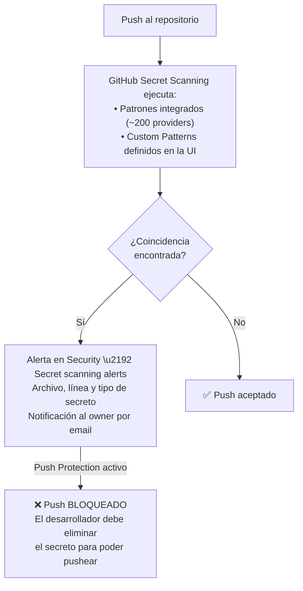

# Secret Scanning — Custom Patterns

GitHub Secret Scanning incluye ~200 patrones integrados para detectar secretos conocidos (GitHub PATs, AWS keys, Stripe keys...). Pero ¿y los secretos que son specíficos de **tu empresa**? Tokens de API internos, identificadores de cuentas de servicio, conexiones a sistemas propietarios. Esos GitHub no los conoce.

**Los Custom Patterns** te permiten definir tus propios patrones con expresiones regulares. En esta guía crearás patrones para los secretos de formato interno que tiene la API demo, exactamente el tipo de secretos que un equipo de seguridad real necesitaría añadir.

## ¿Qué cubre esta guía?

- Cómo escribir y publicar un Custom Pattern desde la UI de GitHub
- Los patrones para los 4 tipos de secretos internos de la demo
- Cómo usar el Dry Run para validar el patrón antes de activarlo
- Cómo combinar Custom Patterns con Push Protection para bloqueo en el momento del commit

---

## ¿Qué es un Custom Pattern?

GitHub Secret Scanning incluye ~200 patrones integrados para detectar secretos conocidos (GitHub PATs, AWS keys, Stripe keys, etc.). Un **Custom Pattern** te permite definir **tus propios patrones** con expresiones regulares para detectar secretos internos de tu empresa que GitHub no conoce por defecto.

---

## ¿Dónde se configura?

> Los custom patterns **no se definen en un archivo del repositorio**. Se configuran directamente en la interfaz de GitHub o mediante la API REST.

### Ruta en la UI de GitHub

```
Settings → Security → Secret scanning → Custom patterns → New pattern
```

### Niveles de aplicación

| Nivel | Aplica a | Ruta en GitHub |
|---|---|---|
| **Repository** | Solo el repo donde se configura | `Settings → Security → Secret scanning` |
| **Organization** | Todos los repos de la organización | `Org Settings → Code security → Secret scanning` |
| **Enterprise** | Toda la empresa | `Enterprise Settings → Code security` |

> Los niveles de organización y empresa requieren licencia **GitHub Advanced Security (GHAS)**.

---

## Campos del Custom Pattern

| Campo | ¿Es requerido? | Descripción |
|---|---|---|
| **Pattern name** | ✅ Sí | Nombre descriptivo (aparece en la alerta) |
| **Secret format** | ✅ Sí | Regex principal que identifica el secreto |
| **Before secret** | ❌ Opcional | Regex de contexto ANTES del secreto (reduce falsos positivos) |
| **After secret** | ❌ Opcional | Regex de contexto DESPUÉS del secreto |
| **Additional match** | ❌ Opcional | Regex adicional que también debe coincidir en el mismo archivo |

### Restricciones de Hyperscan (el motor regex de GitHub)

> GitHub usa la librería [Hyperscan](https://github.com/intel/hyperscan), un subconjunto de PCRE con restricciones importantes:

- **No se permiten patrones de longitud cero** en los campos Before/After secret.
  Esto descarta `["']?`, `\s*`, `.*` y cualquier construcción con `?` o `*` que pueda coincidir con cero caracteres.
- Usa cuantificadores acotados: `{1,5}` en lugar de `*`, `{1,1}` en lugar de `?`.
- Los valores por defecto de GitHub son seguros y funcionan bien en la mayoría de casos:
  - **Before secret (default):** `\A|[^0-9A-Za-z]`: inicio de línea O un carácter no alfanumérico
  - **After secret (default):** `\z|[^0-9A-Za-z]`: fin de línea O un carácter no alfanumérico
- Si no necesitas contexto específico, **deja los campos Before/After vacíos** para usar los defaults.

---

## Patrones de la demo (CustomPatternDemoService.cs)

Los siguientes secretos están hardcodeados en el código de demo y **no serían detectados por GitHub por defecto**. Necesitan un custom pattern configurado.

### Patrón 1 — Internal API Key

Secreto de ejemplo en código:
```csharp
private const string InternalApiKey = "MYCO-PRD-1042-a3f9c21b";
```

Configuración del custom pattern:

| Campo | Valor |
|---|---|
| Pattern name | `MYCO Internal API Key` |
| Secret format | `MYCO-[A-Z]{3}-[0-9]{4}-[a-f0-9]{8}` |
| Before secret | *(dejar vacío; usa el default `\A\|[^0-9A-Za-z]`)* |
| After secret | *(dejar vacío; usa el default `\z\|[^0-9A-Za-z]`)* |
| Additional match | `MYCO` |

> El Secret format es suficientemente específico. Los campos Before/After se dejan vacíos para evitar errores de Hyperscan con cuantificadores de longitud cero.

---

### Patrón 2 — Database Access Token

Secreto de ejemplo en código:
```csharp
private const string DbAccessToken = "DB-TOKEN-20260101-Xk92mNpQ7rLwVjT4";
```

Configuración del custom pattern:

| Campo | Valor |
|---|---|
| Pattern name | `Internal Database Access Token` |
| Secret format | `DB-TOKEN-[0-9]{8}-[A-Za-z0-9]{16}` |
| Before secret | *(dejar vacío)* |
| After secret | *(dejar vacío)* |
| Additional match | `DB-TOKEN` |

---

### Patrón 3 — Service Account Key

Secreto de ejemplo en código:
```csharp
private const string ServiceAccountKey = "SVC-payments-prod-aB3cD4eF5gH6iJ7kL8mN9oP0";
```

Configuración del custom pattern:

| Campo | Valor |
|---|---|
| Pattern name | `Internal Service Account Key` |
| Secret format | `SVC-[a-z]+-[a-z]+-[A-Za-z0-9]{24}` |
| Before secret | *(dejar vacío)* |
| After secret | *(dejar vacío)* |

---

### Patrón 4 — Webhook Secret

Secreto de ejemplo en código:
```csharp
private const string WebhookSecret = "whsec_MyCompanyWebhookSecret1234567890AbCdEf";
```

Configuración del custom pattern:

| Campo | Valor |
|---|---|
| Pattern name | `Internal Webhook Secret` |
| Secret format | `whsec_[A-Za-z0-9]{40}` |
| Before secret | *(dejar vacío)* |
| After secret | *(dejar vacío)* |
| Additional match | `whsec_` |

---

## Flujo completo de detección



---

## Cómo configurar via API REST

```bash
curl -X POST \
  -H "Authorization: Bearer $GITHUB_TOKEN" \
  -H "Accept: application/vnd.github+json" \
  https://api.github.com/repos/OWNER/REPO/secret-scanning/custom-patterns \
  -d '{
    "name": "MYCO Internal API Key",
    "secret_format": "MYCO-[A-Z]{3}-\\d{4}-[a-f0-9]{8}",
    "keywords": ["MYCO", "api_key", "internal"]
  }'
```

> Para organización: `POST /orgs/{org}/secret-scanning/custom-patterns`

---

## Dry Run — prueba antes de activar

Antes de activar un patrón definitivamente, usa **"Save and dry run"** en la UI:

1. GitHub escanea el **historial de commits completo** con el nuevo patrón
2. Muestra cuántas coincidencias encuentra y en qué archivos
3. Permite ajustar la regex para reducir **falsos positivos** antes de activarlo

> Un patrón demasiado genérico puede generar cientos de alertas ruidosas. El dry run evita ese problema.

---

## Push Protection con Custom Patterns

Una vez que el custom pattern está activo, puedes combinarlo con **Push Protection**:

```
Settings → Security → Secret scanning → Push protection → Enable
```

Con Push Protection activado:
- El push es **bloqueado automáticamente** si contiene un secreto que coincida con el patrón
- El desarrollador ve el error en su terminal y debe remover el secreto
- El secreto **nunca llega al historial de Git**: es la forma más segura de prevención

---

## Siguiente paso

Con los Custom Patterns configurados, tienes una cobertura completa de Secret Scanning adaptada a los secretos de tu empresa.

🏠 Vuelve al índice: [README.md — Workshop GitHub Advanced Security](../README.md)
