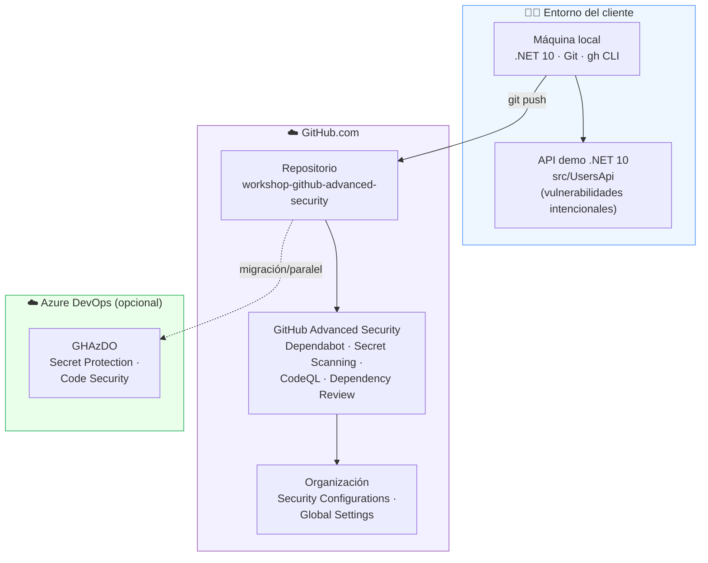
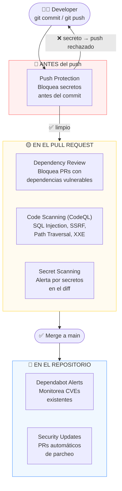
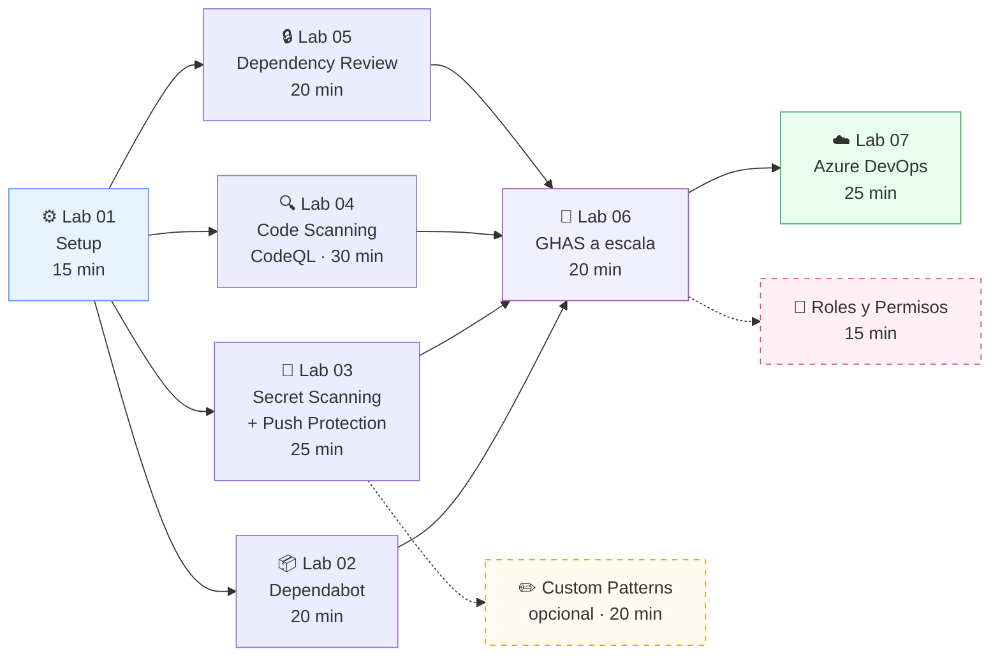
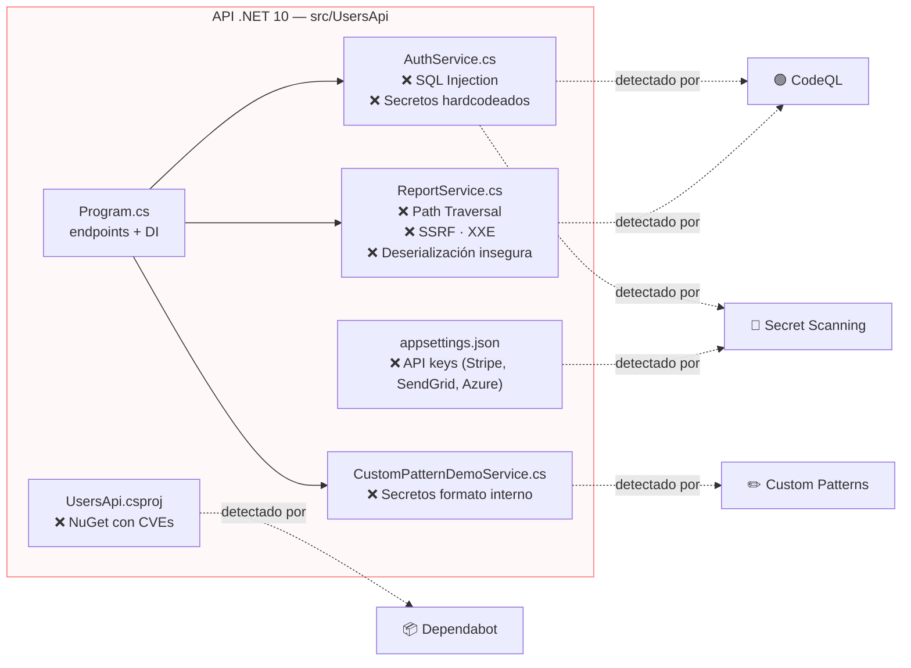

# Guía de Facilitación — Workshop GitHub Advanced Security (GHAS)

> **Público objetivo de esta guía:** el/la facilitador(a) que va a **impartir la sesión con el cliente**.
> Aquí encontrarás qué necesita tener listo el cliente (prerequisitos), cómo se estructura el curso,
> los diagramas de arquitectura y un guion de sesión paso a paso para entregarla con confianza.

---

## 1. Resumen ejecutivo

Este workshop lleva al cliente **de cero a operativo en GitHub Advanced Security (GHAS)** usando una
**API .NET 10 intencionalmente vulnerable** (`UsersApi`). El cliente ve, en vivo, cómo GHAS detecta y
bloquea vulnerabilidades reales: SQL Injection, Path Traversal, SSRF, XXE, deserialización insegura,
secretos hardcodeados y dependencias con CVEs conocidas.

| Dato | Valor |
|---|---|
| Duración total | ~2h 45min (labs) + 30–45 min de setup/Q&A |
| Formato | Hands-on guiado (el facilitador demuestra, el cliente replica) |
| Nivel | Introductorio–Intermedio (no requiere experiencia previa en GHAS) |
| App demo | API REST .NET 10 (`src/UsersApi`) |
| Resultado | Cliente capaz de habilitar, operar y escalar GHAS en sus repos |

> ⚠️ **Recordatorio clave para el cliente:** el repositorio contiene vulnerabilidades **intencionales**.
> Nunca debe desplegarse en un entorno real. Ver [SECURITY.md](./SECURITY.md).

---

## 2. Prerequisitos que debe tener el cliente

Divide los prerequisitos en tres bloques: **cuentas/licencias**, **herramientas locales** y **permisos**.
Envía esta lista al cliente **con al menos 2–3 días de antelación** para evitar bloqueos el día de la sesión.

### 2.1 Cuentas, licencias y accesos

| Requisito | Detalle | Obligatorio para |
|---|---|---|
| Cuenta de GitHub | Personal u organizacional | Todos los labs |
| GHAS habilitado | Licencia de GitHub Advanced Security (o Secret Protection + Code Security) | Labs 02–05 |
| Permisos de **Admin** en el repo | Para habilitar features en *Settings → Advanced Security* | Lab 01 |
| Organización de GitHub | Con permisos de **Org Owner** o **Security Manager** | Lab 06 (a escala) |
| Organización de **Azure DevOps** | Con licencia GHAzDO (Secret Protection / Code Security) | Lab 07 (opcional) |
| Suscripción de Azure | Asociada a la org de Azure DevOps para el billing por *active committers* | Lab 07 (opcional) |

> 💡 **Si el cliente no tiene GHAS aún:** puede activar una **prueba (trial)** de GitHub Advanced Security
> a nivel de organización, o usar un repositorio **público** (donde varias features de GHAS son gratuitas).

### 2.2 Herramientas locales (en la máquina de cada participante)

| Herramienta | Versión mínima | Verificar con | Descarga |
|---|---|---|---|
| .NET SDK | 10.0 | `dotnet --version` | https://dotnet.microsoft.com/download |
| Git | 2.x | `git --version` | https://git-scm.com/ |
| GitHub CLI (`gh`) | 2.x | `gh --version` | https://cli.github.com/ |
| Editor de código | — | — | VS Code recomendado |
| Navegador moderno | — | — | Para la UI de GitHub y Swagger |

### 2.3 Permisos y red

- Acceso de red saliente a `github.com`, `api.github.com` y `dotnet.microsoft.com` (para `dotnet restore`).
- Capacidad de **hacer push** al repositorio (para las demos de Push Protection y Dependency Review).
- Para Lab 07: acceso a `dev.azure.com` y permisos de **Project/Org Settings** en Azure DevOps.

### 2.4 Checklist de verificación previa (para el facilitador)

Ejecuta esto en tu propia máquina antes de la sesión para validar el entorno:

```bash
dotnet --version        # Debe mostrar 10.x
git --version           # 2.x o superior
gh --version            # 2.x o superior
gh auth status          # Debe estar autenticado

# Clonar y arrancar la app demo
git clone https://github.com/armandoblanco/workshop-github-advanced-security.git
cd workshop-github-advanced-security/src/UsersApi
dotnet restore
dotnet run              # Abre http://localhost:5000/swagger
```

---

## 3. Arquitectura del curso

### 3.1 Mapa general del workshop



### 3.2 Defensa en profundidad — cuándo actúa cada control

Este es el concepto central que el cliente debe llevarse de la sesión: **GHAS no es una herramienta, es
una cadena de controles** que protege el código en cada etapa.



### 3.3 Ruta de aprendizaje (secuencia de labs)



### 3.4 Arquitectura de la aplicación demo y sus vulnerabilidades



---

## 4. Inventario de vulnerabilidades (chuleta del facilitador)

Usa esta tabla para saber **qué feature de GHAS demuestra cada vulnerabilidad** y dónde vive en el código.

### Código (CodeQL — Lab 04)

| Vulnerabilidad | CWE | Archivo | Endpoint |
|---|---|---|---|
| SQL Injection | CWE-89 | `AuthService.cs` | `POST /api/auth/login` |
| SQL Injection | CWE-89 | `AuthService.cs` | `GET /api/auth/search` |
| Path Traversal | CWE-22 | `ReportService.cs` | `GET /api/reports/file` |
| SSRF | CWE-918 | `ReportService.cs` | `GET /api/reports/fetch` |
| XXE | CWE-611 | `ReportService.cs` | `POST /api/reports/parse-xml` |
| Deserialización insegura | CWE-502 | `ReportService.cs` | `POST /api/reports/deserialize` |

### Dependencias (Dependabot — Lab 02)

| Paquete | Versión | Severidad | CVE |
|---|---|---|---|
| `Newtonsoft.Json` | 12.0.2 | High | GHSA-5crp-9r3c-p9vr |
| `Microsoft.Data.SqlClient` | 2.0.0 | High | GHSA-98g6-xh36-x2p7 |
| `System.IdentityModel.Tokens.Jwt` | 5.6.0 | Moderate | GHSA-59j7-ghrg-fj52 |
| `log4net` | 2.0.10 | High | GHSA-rxg9-xrhp-64gj |

### Secretos (Secret Scanning — Lab 03 / Custom Patterns)

| Secreto | Ubicación | Detectado por |
|---|---|---|
| GitHub PAT (`ghp_`) | `AuthService.cs` | Secret Scanning |
| AWS Access Key (`AKIA`) | `AuthService.cs` | Secret Scanning |
| Stripe / SendGrid / Azure keys | `appsettings.json` | Secret Scanning |
| API key corporativa (`MYCO-...`) | `CustomPatternDemoService.cs` | Custom Patterns |

---

## 5. Guion de la sesión (agenda sugerida)

| Bloque | Contenido | Tiempo | Doc de referencia |
|---|---|---|---|
| 0 | Bienvenida + objetivos + advertencia de código vulnerable | 10 min | Este archivo |
| 1 | **Lab 01** — Setup: clonar, arrancar API, habilitar GHAS | 15 min | [01-setup.md](./docs/01-setup.md) |
| 2 | **Lab 02** — Dependabot: alertas de CVEs y updates automáticos | 20 min | [02-dependabot.md](./docs/02-dependabot.md) |
| 3 | **Lab 03** — Secret Scanning + Push Protection (demo de push bloqueado) | 25 min | [03-secret-scanning.md](./docs/03-secret-scanning.md) |
| 4 | **Lab 04** — Code Scanning con CodeQL: revisar alertas de flujo de datos | 30 min | [04-code-scanning.md](./docs/04-code-scanning.md) |
| — | ☕ Descanso | 10 min | — |
| 5 | **Lab 05** — Dependency Review: bloquear PR con dependencia vulnerable | 20 min | [05-dependency-review.md](./docs/05-dependency-review.md) |
| 6 | **Lab 06** — GHAS a escala: Security Configurations y Global Settings | 20 min | [06-ghas-at-scale.md](./docs/06-ghas-at-scale.md) |
| 7 | **Lab 07** — GHAS en Azure DevOps (si aplica al cliente) | 25 min | [07-ghas-azure-devops.md](./docs/07-ghas-azure-devops.md) |
| 8 | **Roles y Permisos** + **Custom Patterns** (según interés) | 15–20 min | [08-roles-y-permisos.md](./docs/08-roles-y-permisos.md) · [custom-patterns.md](./docs/custom-patterns.md) |
| 9 | Cierre: recap defensa en profundidad + próximos pasos + Q&A | 15 min | Este archivo |

> **Adaptación:** si el cliente usa **GitHub.com**, omite el Lab 07. Si usa **Azure DevOps**, dedícale más
> tiempo. Los labs 02–05 son independientes: si vas justo de tiempo, prioriza **Lab 03 (Secret Scanning)**
> y **Lab 04 (CodeQL)** por su impacto visual.

---

## 6. Consejos de entrega (facilitación)

- **Empieza por el impacto:** menciona el dato de las brechas de datos (~4.88M USD, IBM 2024) para anclar el "por qué".
- **Demuestra en vivo primero, luego que replique el cliente.** El momento más potente es el **push bloqueado** por Push Protection (Lab 03): hazlo en vivo.
- **Muestra la trazabilidad:** cada alerta de CodeQL enlaza al endpoint y a la línea exacta. Navega desde la alerta hasta el código.
- **Conecta cada lab con el diagrama de defensa en profundidad** (sección 3.2): al terminar cada lab, señala en qué etapa del ciclo actúa.
- **Prepara un repo de respaldo** ya con GHAS habilitado por si el del cliente tarda en activarse.
- **Ten a mano la chuleta de vulnerabilidades** (sección 4) para responder "¿dónde está exactamente?".

---

## 7. Solución de problemas frecuentes

| Síntoma | Causa probable | Solución |
|---|---|---|
| `dotnet run` falla | .NET SDK no es 10.x | Verificar `dotnet --version`, instalar SDK 10 |
| No aparecen alertas de Dependabot | Dependency Graph deshabilitado | Habilitar en *Settings → Advanced Security* |
| CodeQL no corre | Workflow no ejecutado / permisos de Actions | Revisar la pestaña **Actions** y `.github/workflows/codeql.yml` |
| Push Protection no bloquea | Feature no habilitada en el repo | Habilitar Secret Protection + Push Protection (Lab 01) |
| No puede habilitar GHAS | Falta rol Admin / licencia | Confirmar rol y licencia (sección 2.1) |
| Lab 07 sin billing | Suscripción Azure no asociada | Asociar suscripción a la org de Azure DevOps |

---

## 8. Próximos pasos para el cliente

Después de la sesión, sugiere al cliente:

1. **Habilitar GHAS en sus repos reales** empezando por los de mayor criticidad.
2. **Definir una Security Configuration** en la organización (Lab 06) para estandarizar.
3. **Activar Push Protection en toda la org** para prevenir fugas de secretos.
4. **Integrar CodeQL en sus pipelines** de PR como control obligatorio (required check).
5. **Definir Custom Patterns** para sus formatos internos de secretos (custom-patterns).
6. **Asignar roles de Security Manager** para delegar la gestión sin dar admin.

---

## 9. Referencias

- [GitHub Advanced Security Docs](https://docs.github.com/en/code-security)
- [CodeQL Query Suites](https://docs.github.com/en/code-security/code-scanning/managing-your-code-scanning-configuration/codeql-query-suites)
- [Dependabot Configuration](https://docs.github.com/en/code-security/dependabot/dependabot-version-updates/configuration-options-for-the-dependabot.yml-file)
- [Secret Scanning Patterns](https://docs.github.com/en/code-security/secret-scanning/introduction/supported-secret-scanning-patterns)
- [GHAS for Azure DevOps](https://learn.microsoft.com/en-us/azure/devops/repos/security/configure-github-advanced-security-features)
- Documentación interna del workshop: [README.md](./README.md) y carpeta [docs/](./docs/)
